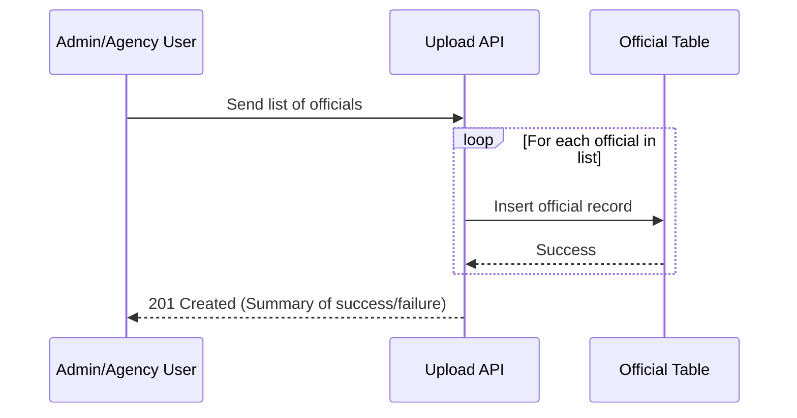
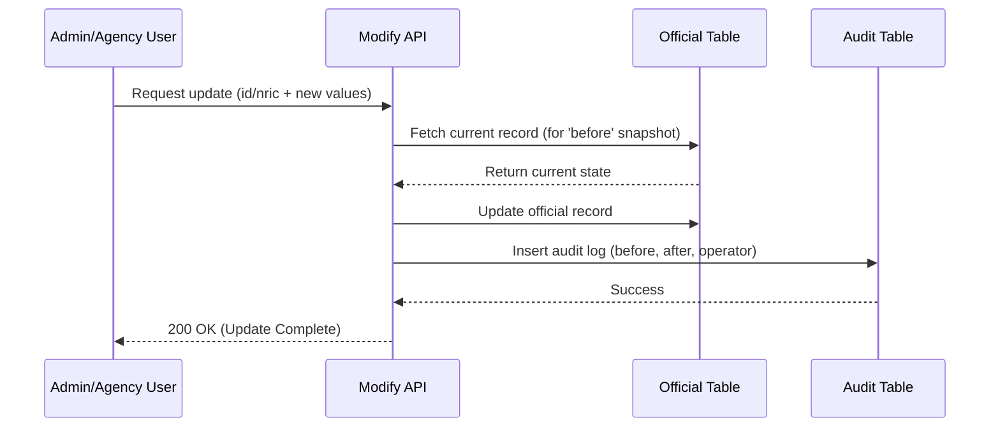
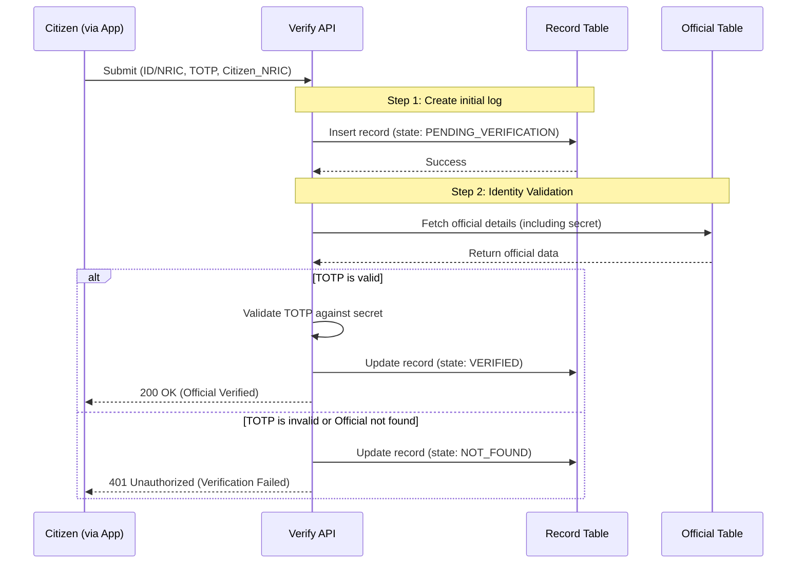

# VerifyGov Technical Documentation

This document outlines the technical architecture for the **VerifyGov** system, including the relational database schema and the backend service specifications.

---

## 1. Relational Database Schema

The system utilizes a relational database to maintain a single source of truth for authorized officials, track all administrative changes through an audit log, and maintain a history of verification attempts.

Each table should be hosted in its own dedicated database to facilitate better read-write performance as replication / sharding can be optimised for each table's use case.

### 1.1 Official Table
Stores the identity and credentials of authorized government officials.

Should have many replicas to facilitate read performance.

| Column Name | Data Type | Constraints | Description |
| :---           | :---      | :---        | :--- |
| `id`           | int64     | PK, Auto-inc| Unique identifier for the official. |
| `nric`         | String    | Unique      | National Registration Identity Card number. |
| `name`         | String    | Not Null    | Full name of the official. |
| `agency`       | String    | Not Null    | Government agency name. |
| `rank`         | String    |             | Official's rank/position. |
| `role`         | String    |             | Official's specific role. |
| `is_active`    | Boolean   | Default True| Whether the official is currently authorized. |
| `created_time` | int64     |             | Unix timestamp of creation. |
| `modified_time`| int64     |             | Unix timestamp of last update. |
| `operator`     | String    |             | The ID/Name of the user who performed the action. |
| `secret`       | String    |             | Seed/Secret key for TOTP (2FA) generation. Salted and hashed. |

### 1.2 Audit Table
Maintains a history of all modifications made to the `Official` table for security and accountability.

Not likely to need high read-write performance.

| Column Name | Data Type | Constraints | Description |
| :---           | :---      | :---        | :--- |
| `id`           | int64     | PK, Auto-inc| Unique identifier for the audit log. |
| `official_id`  | int64     | FK (Official)| Reference to the modified official. The FK should not be enforced to facilitate better performance. |
| `before`       | JSON      |             | The state of the record before the modification. |
| `after`        | JSON      |             | The state of the record after the modification. |
| `operator`     | String    |             | The ID/Name of the user who performed the update. |

### 1.3 Record Table
Logs every verification attempt made by citizens to track interaction patterns and detect anomalies.

Needs sharding based on citizen_nric to have good write performance and to ensure high availablility, if one cluster goes down at least others should remain unaffected while failover happens.

Past records can be archived or flushed once enough time has passed.

| Column Name | Data Type | Constraints | Description |
| :---           | :---      | :---        | :--- |
| `id`           | int64     | PK, Auto-inc| Unique identifier for the verification event. |
| `official_id`  | int64     | FK (Official)| Reference to the official being verified. The FK should not be enforced to facilitate better performance. |
| `citizen_nric` | String    |             | The NRIC of the citizen performing the scan/check. |
| `created_time` | int64     |             | Unix timestamp of the verification attempt. |
| `operator`     | String    |             | The system or app identifier. |
| `state`        | ENUM      |             | `PENDING_VERIFICATION`, `VERIFIED`, `NOT_FOUND` |

---

## 2. Backend Service

The backend service manages the business logic for onboarding officials, updating credentials, and processing real-time verification requests.

### 2.1 Upload API
**Endpoint:** `POST /api/v1/officials/upload`  
**Description:** Bulk inserts a list of new authorized officials into the system. Only for internal usage.

### 2.2 Modify API
**Endpoint:** `PATCH /api/v1/officials/modify`  
**Description:** Updates an existing official's details and ensures an audit trail is created. Only for internal usage.

### 2.3 Verify API
**Endpoint:** `POST /api/v1/verify`  
**Description:** The core verification logic. It validates the TOTP provided by the official against the stored secret. The only public facing endpoint.

